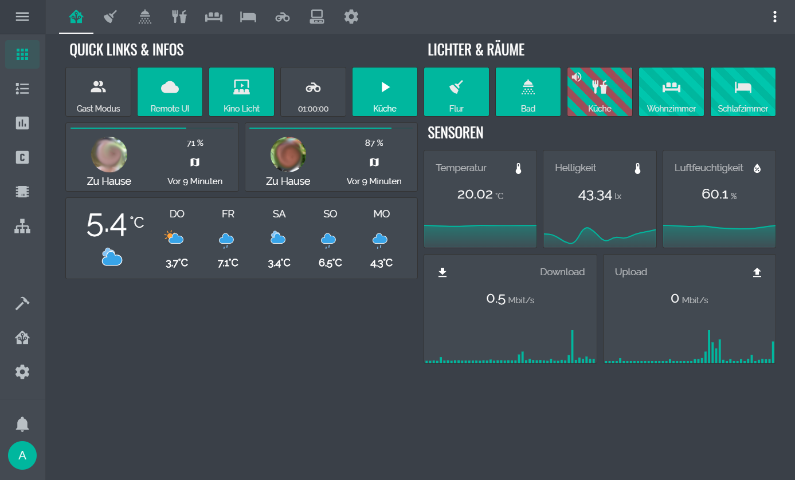
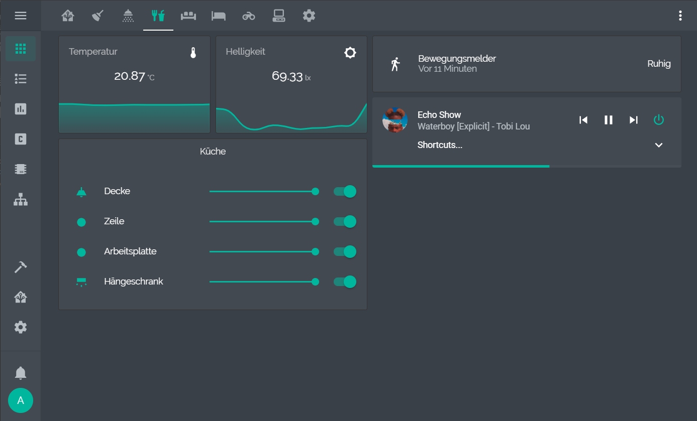
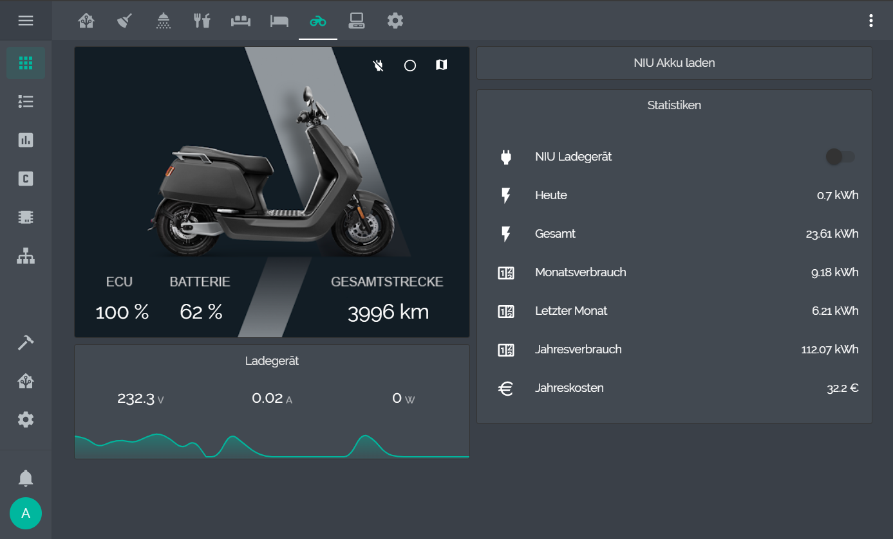
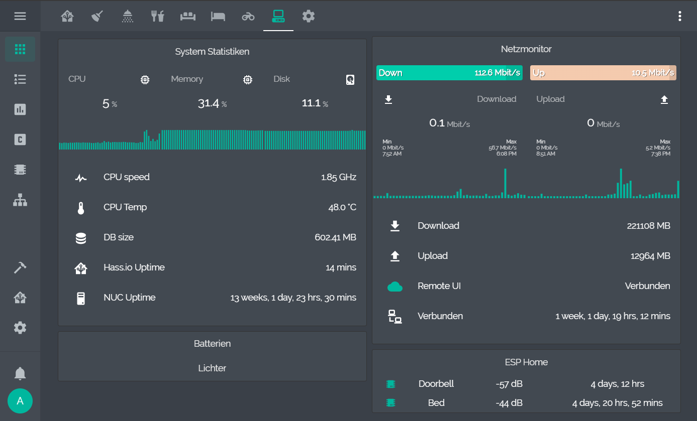

# aFFekopps Home Assistant Configuration

This is my Home Assistant configuration. My HA Machine is an Intel NUC BOXNUC6CAYH with 4GB RAM and 120GB SSD. It's running Ubuntu 18.04 with Hass.io in Docker.

## Dashboard

## Automations

All of my automations are in Node Red, Home Assistant is just my state machine. Some notable autmations are:

- turning Hue motion sensors off on demand
- turn everything off when everyone is in bed
- presence detection with different states (just arrived, just left, extended away etc.)
- alert when there ist movement in the apartment and nobody is home
- reminder to open the window in the bathroom when a humidity threshold is reached
- music following you
- guest mode automations
- and many more...

## Hardware

- Conbee II using ZHA integration
- Philips Hue Lights
- Philips Hue motion sensors in every room
- Philips hue remotes with custom 3d printed switch frames
- Xiaomi Buttons
- Xiaomi Humidity sensor
- Xiaomi Door/Window sensors
- Amazon Echo Dot / Echo Show 8 / 2x Echo 3rd gen
- Fire TV 4k

## DIY

- d1mini with ina219 current sensor and a relay to grab the doorbell signal and trigger the door opener
- esp8266 with hx711 and load cells to check who's in bed

## More Screenshots

